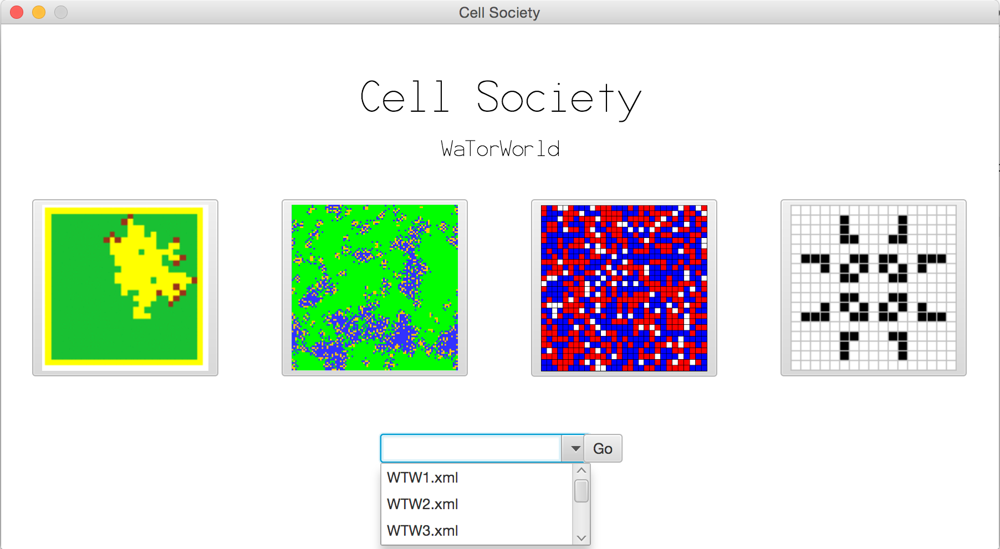
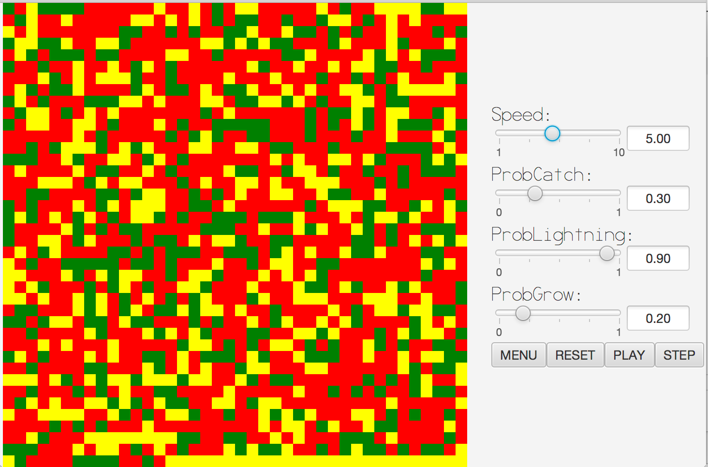
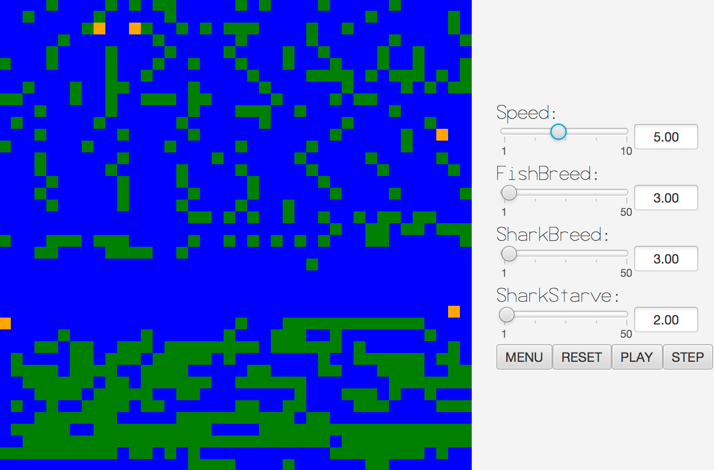
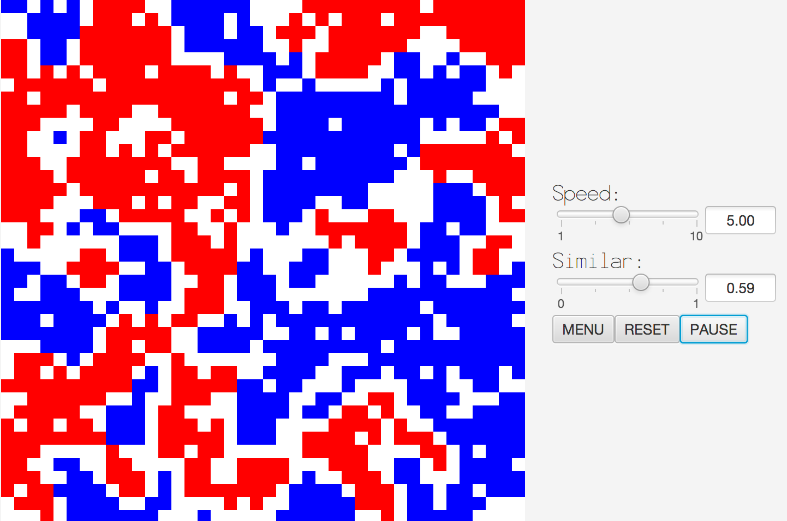
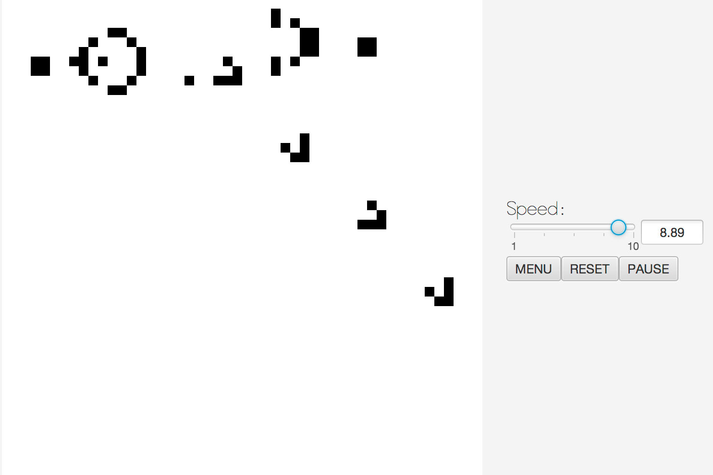

# Cell Society
====

Assignment for Duke University CS308 - Software Implementation & Design

Java program using JavaFX that animates multiple Cellular Automata (CA) 2D-simulations.

Chris Streiffer, David Zhou and I created a program that would allow users to run four of the major Cellular Automata simulations, with initial parameters set by included XML files. You can also create your own XML file using an included XMLGenerator file.  The four Cellular Automata simulations are... 

1. [Schelling's Model of Segregation](http://nifty.stanford.edu/2014/mccown-schelling-model-segregation/)
2. [Wa-Tor World model of predator-prey relationships](http://nifty.stanford.edu/2011/scott-wator-world/)
3. [Spreading of Fire](http://nifty.stanford.edu/2007/shiflet-fire/)
4. [Conway's Game of Life](https://en.wikipedia.org/wiki/Conway%27s_Game_of_Life)

Some Screenshots can be seen below...

##Main Menu

##Spreading of Fire

##Wa-Tor World Model of predator-prey Relationships

##Schelling's Model of Segregation

====

##Conway's Game of Life

====

Installation Instruction:

Create a project in eclipse (or another IDE) and copy the CellSociety folder into the src folder of that new project. Make sure you are able to use JavaFX (part of Java 8). 
